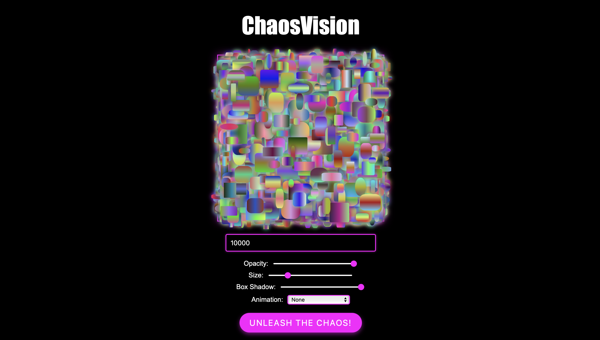

# ChaosVision

ChaosVision is a web application that harnesses mathematics to discover the beauty hidden within chaos. It generates mesmerising visual patterns by utilising a combination of shapes, opacity, sizes, box shadow, and animation effects. With its intuitive interface, users can explore the creative realm by incorporating numbers and numeric expressions, resulting in intricate and harmonious compositions. 

## Features
- **Numerically Driven Art Generation:** Create art by entering numbers or numeric expressions.
- **Customizable Shape Properties:** Personalise with options to adjust opacity, size, and box shadow.
- **Dynamic Effects:** Choose from a variety of animations to add captivating visual effects.
- **Error Handling:** Validate numbers or the results of numeric expressions to ensure they are less than 10,000 and prevent non-numeric inputs.

## Accessing ChaosVision
To access ChaosVision, simply visit the following website: https://sheng254.github.io/ChaosVision/

## Potential Enhancements for the Future
- Expand the available math functions to include advanced operations like trigonometry, logarithms, and exponentiation, allowing for even more complex and creative expressions.
- Introduce more shape types, such as polygons, curves, or even custom shapes, to offer a broader range of design possibilities.
- Add functionality for users to save the generated arts as image files.
- Improve the performance of the generation process to enhance smooth rendering and responsiveness, particularly when handling large input values.

## Contributing
Contributions are welcome! Feel free to reach out with your suggestions, bug reports, or feature requests.

## License
This project is licensed under the [MIT License](LICENSE).
