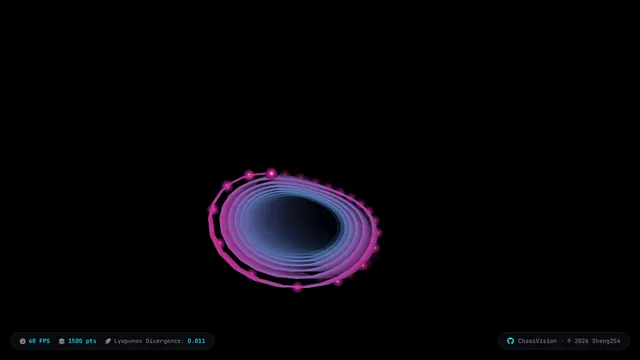
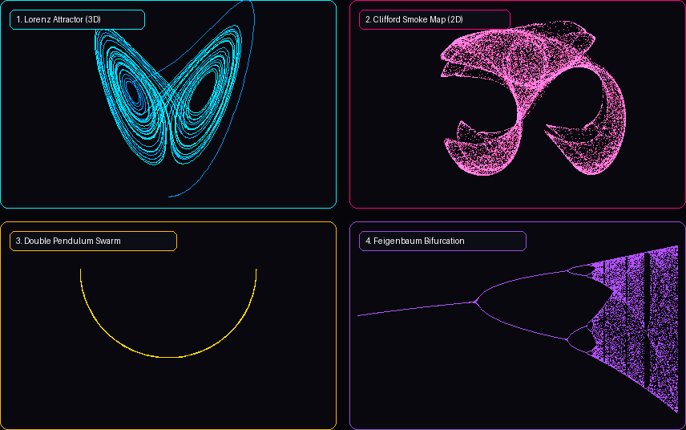

# ChaosVision

[](LICENSE)
[](https://sheng254.github.io/ChaosVision/)
[-informational.svg)]()
[]()

<div align="center">
  
  <p><em>Real-time 3D trajectory ribbons, Lyapunov divergence tracking, and live generative soundscapes.</em></p>
</div>

<p align="center">
  <a href="https://sheng254.github.io/ChaosVision/">
    
  </a>
</p>

ChaosVision is an interactive computational laboratory and generative art studio for non-linear dynamical systems, deterministic chaos, strange attractors, and fractal bifurcations.

Built with native ECMAScript modules, direct HTML5 Canvas projection pipelines, and the Web Audio API, ChaosVision operates with zero external build dependencies, zero framework overhead, and hardware-accelerated 60/120 FPS numerical simulation.

---

## Visual Exhibition Gallery

<div align="center">
  
  <p><em>(1) 3D Continuous Attractors, (2) 2D Discrete Silk Manifolds, (3) Double Pendulum Swarm, (4) Feigenbaum Bifurcation Cascade.</em></p>
</div>

---

## Key Features

### 1. High-Precision Numerical Integrators & Dynamics
* **Runge-Kutta 4th-Order (RK4) Solver**: High-precision numerical integration for continuous differential equations with adaptive sub-stepping (up to 64 steps/frame) and finite-number boundary recovery.
* **Lagrangian Dynamics Engine**: Simulates multi-pendulum mechanical systems with kinetic/potential energy monitoring and automatic rest-state re-energization when friction is adjusted.
* **Visual Equation Editor & Multi-Equation AST Sandbox**: Real-time visual math input with formatted LaTeX translation, 2D/3D multi-equation compiling ($x_{n+1}, y_{n+1}, z_{n+1}$), and isolated parameter scope.
* **Lyapunov Divergence Tracking**: Calculates Euclidean phase-space separation across parallel trajectories initialized with microscopic $10^{-4}$ offsets.
* **3D Phase-Space Feigenbaum Bifurcation Cascade**: Canonical $(r, x_n, x_{n-1})$ delay-coordinate embedding combining classical 2D diagrams with 3D period-doubling spatial manifolds.
* **Anti-Stall & Anti-Collapse Watchdog**: Real-time velocity monitoring prevents discrete maps from collapsing into single-point equilibrium traps.

### 2. Unified Rendering & Camera Architecture
* **Adaptive Density Accumulator**: Accumulates millions of particle iterations with zoom-compensated batch scaling (up to $100,000+$ pts/frame) and adaptive point sizing to preserve luminosity.
* **Unified 3D Perspective Projection Engine**: Full 3-axis pitch, yaw, pan, and perspective scaling across continuous attractors, discrete maps, pendulums, and bifurcations.
* **Inertial Multi-Touch Camera & Universal Auto-Rotation**: Frame-rate independent constant angular velocity ($\omega = 0.15\text{ rad/s}$) across all systems with seamless drag-pause and instant resumption.
* **Curated Designer Color Gradients**: Bioluminescence, Cyberpunk, CRT Matrix Green, Solar Flare, Cosmic Nebula, Electric Amethyst, and Infrared.

### 3. Physics-Coupled Generative Zen Soundscapes (Web Audio API)
* **8-Voice Polyphonic Voice Pool**: Discrete decaying singing bowl and crystal chime plucks with analog warm lowpass filtering.
* **Harmonic Pentatonic Tuning**: Calibrated to C Major 9 and A Minor scales ($C_4$ through $C_6$).
* **100% Deterministic Physics Alignment**: 
  * *3D Attractors*: Orbital curvature turning cusps and $z$-elevation drive pitch and left-right panning.
  * *Double Pendulum*: Lagrangian kinetic energy peaks and outer bob height drive resonant singing bowls and celestial bell flips.
  * *2D Discrete Maps & Sandbox*: Polar phase angle $\theta = \operatorname{atan2}(y, x)$ directly traces the fractal's geometric winding number.
  * *Bifurcation Cascade*: State coordinate $x$ sonifies pure harmonic intervals in periodic windows and complex shimmering chords in chaos.

### 4. Interactive Live Museum Tour
* **Draggable Exhibit Deck**: Floating, repositionable educational card synchronized with the live canvas simulation.
* **Comprehensive 13-Exhibit Catalog**: Covers Lorenz, Aizawa, Thomas, Rössler, Chen, Halvorsen, Clifford, De Jong, Tinkerbell, Ikeda, Gumowski-Mira, Double Pendulum Swarm, and Feigenbaum Bifurcation.
* **Two-Way Control Sync**: Switching systems in the control drawer updates the tour card instantly, and navigating exhibits updates the drawer.

### 5. Studio Exporters & State Serialization
* **4K Ultra-HD Wallpaper**: Asynchronously renders a dedicated $3840 \times 2160$ offscreen PNG with supersampling off the main JS thread.
* **Universal Vector SVG Export**: Converts continuous 3D orbital loops, 20,000-point discrete maps, pendulums, and bifurcations into publication-ready `<path>` and `<circle>` vector artwork without artifacts.
* **High-Fidelity Shareable URL State**: Serializes multi-equations, math variables, camera transform, speed, decay, and color ramps with strict parameter schema isolation.

---

## Dynamical Systems Catalog

| System Name | Type | Mathematical Formulation | Primary Parameters |
| :--- | :--- | :--- | :--- |
| **Lorenz Attractor** | 3D Continuous | $\dot{x} = \sigma(y-x), \dot{y} = x(\rho-z)-y, \dot{z} = xy-\beta z$ | $\sigma$ (Viscosity), $\rho$ (Heat), $\beta$ (Aspect) |
| **Aizawa Attractor** | 3D Continuous | $\dot{x} = (z-b)x - dy, \dot{y} = dx + (z-b)y, \dot{z} = c + az - \frac{z^3}{3} - (x^2+y^2)(1+ez) + fzx^3$ | $a$ (Growth), $d$ (Vortex), $e$ (Coupling) |
| **Thomas Labyrinth** | 3D Continuous | $\dot{x} = \sin(y) - bx, \dot{y} = \sin(z) - by, \dot{z} = \sin(x) - bz$ | $b$ (Energy Damping / Friction) |
| **Rössler Attractor** | 3D Continuous | $\dot{x} = -y - z, \dot{y} = x + ay, \dot{z} = b + z(x - c)$ | $a$ (Spiral), $c$ (Fold / Catapult) |
| **Chen System** | 3D Continuous | $\dot{x} = a(y - x), \dot{y} = (c - a)x - xz + cy, \dot{z} = xy - bz$ | $a$ (Vortex), $c$ (Cross-Scroll) |
| **Halvorsen Attractor** | 3D Continuous | $\dot{x} = -ax - 4y - 4z - y^2, \dot{y} = -ay - 4z - 4x - z^2, \dot{z} = -az - 4x - 4y - x^2$ | $a$ (Coupling / Dissipation) |
| **Peter de Jong Map** | 2D Discrete | $x_{n+1} = \sin(ay_n) - \cos(bx_n), y_{n+1} = \sin(cx_n) - \cos(dy_n)$ | $a, b, c, d$ (Interference Harmonics) |
| **Clifford Map** | 2D Discrete | $x_{n+1} = \sin(ay_n) + c\cos(ax_n), y_{n+1} = \sin(bx_n) + d\cos(by_n)$ | $a, b, c, d$ (Toroidal Frequencies) |
| **Hopalong Attractor** | 2D Discrete | $x_{n+1} = y_n - \mathrm{sgn}(x_n)\sqrt{\vert bx_n - c \vert}, y_{n+1} = a - x_n$ | $a, b, c$ (Fractal Displacement) |
| **Ikeda Map** | 2D Discrete | $t = k - \frac{p}{1+x^2+y^2}, x_{n+1} = 1+u(x\cos t - y\sin t), y_{n+1} = u(x\sin t + y\cos t)$ | $u$ (Reflectivity), $p$ (Refraction) |
| **Gumowski-Mira Map** | 2D Discrete | $x_{n+1} = y + \alpha(1-\beta y^2)y + F(x), y_{n+1} = -x + F(x_{n+1})$ | $\alpha$ (Perturbation), $\mu$ (Stability) |
| **Tinkerbell Map** | 2D Discrete | $x_{n+1} = x_n^2 - y_n^2 + ax_n + by_n, y_{n+1} = 2x_n y_n + cx_n + dy_n$ | $a, b, c, d$ (Quadratic Shear) |
| **Double Pendulum** | Lagrangian Mechanics | $L = T - V$ evaluated via 4th-order Runge-Kutta equations of motion | Gravity ($g$), Friction, Swarm Count |
| **Feigenbaum Cascade** | 3D Delay Manifold | $x_{n+1} = r \cdot x_n(1 - x_n)$ in 3D delay embedding $(r, x_n, x_{n-1})$ | Growth rate ($r$), Settle, Samples |
| **Custom Sandbox** | Multi-Equation AST | Real-time visual math inputs ($x_{n+1}, y_{n+1}, z_{n+1}$) with automatic parameter binding | User variables ($a, b, c, \dots$) |

---

## Architecture & Codebase Structure

```
ChaosVision/
├── index.html              # Core application entry point and HUD layout
├── styles.css              # Glassmorphic dark design system and responsive styles
├── LICENSE                 # MIT Open Source License (c) 2026 Sheng254
├── README.md               # Technical documentation
├── assets/
│   ├── chaosvision.webp    # Animated demonstration of 3D chaotic ribbons
│   └── gallery_showcase.png# 4-tile comparative systems gallery
└── src/
    ├── main.js             # Main render loop coordinator and lifecycle manager
    ├── config/
    │   ├── palettes.js     # Curated mathematical color gradient definitions
    │   └── presets.js      # Exhibition catalog and editorial educational metadata
    ├── math/
    │   ├── rk4.js          # Runge-Kutta 4th-Order numerical integrator & swarm buffer
    │   ├── attractors.js   # Continuous and discrete mathematical system catalog
    │   ├── pendulum.js     # Lagrangian double pendulum physics solver
    │   ├── bifurcation.js  # 3D phase-space Feigenbaum bifurcation cascade engine
    │   └── parser.js       # Safe AST tokenizer and bytecode formula compiler
    ├── renderer/
    │   ├── camera.js       # Inertial orbit camera, panning, and touch pinch zoom
    │   ├── canvas2d.js     # High-density particle density accumulator & anti-stall
    │   └── webgl3d.js      # 3D trajectory ribbons and pendulum projection engine
    ├── audio/
    │   └── sonifier.js     # Generative Web Audio API Zen soundscape
    └── ui/
        ├── hud.js          # Control deck, draggable museum tour, and tooltips
        ├── exporter.js     # Asynchronous 4K wallpaper and universal vector SVG exporters
        └── urlState.js     # URL hash parameter serialization and decompression
```

---

## Keyboard Shortcuts

| Shortcut | Action | Description |
| :---: | :--- | :--- |
| <kbd>T</kbd> | **Tutorial** | Toggle studio guide and navigation controls |
| <kbd>R</kbd> | **Recenter** | Smoothly recenter camera angle, pan offset, and zoom |
| <kbd>M</kbd> | **Audio Mute / Play** | Toggle generative ambient soundscape |
| <kbd>H</kbd> | **Toggle Drawer** | Collapse or expand the left Dynamical Controls drawer |

---

## Getting Started

ChaosVision requires no build tools, compilers, or package managers.

### Running Locally

1. Clone the repository:
   ```bash
   git clone https://github.com/Sheng254/ChaosVision.git
   cd ChaosVision
   ```

2. Start any local HTTP server:
   ```bash
   # Using Python 3
   python3 -m http.server 8080

   # Or using Node.js
   npx serve .
   ```

3. Open your browser and navigate to:
   ```
   http://localhost:8080
   ```

---

## License

ChaosVision is open-source software licensed under the [MIT License](LICENSE).

Copyright (c) 2026 **Sheng254**.
