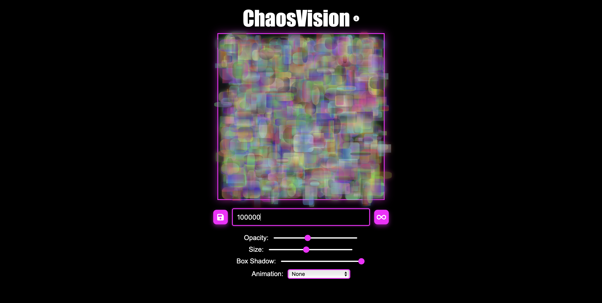

# ChaosVision 🌀👁️‍🗨️

Inspired by Chaos Theory, ChaosVision is a web application that uses mathematics to discover the beauty within chaos. It generates chaotic visual patterns through a blend of shapes, opacity, sizes, box shadows, and animations.

This application reflects Chaos Theory principles, where small changes in input lead to different outcomes.

## Features
- **Numerically Driven Art Generation:** Create art by entering numbers or numeric expressions, with input sanitisation to allow only valid mathematical characters.
- **Customisable Shape Properties:** Personalise with options to adjust opacity, size, and box shadow.
- **Dynamic Effects:** Choose from a variety of animations to add captivating visual effects.
- **Error Handling:** Validate numbers or the results of numeric expressions to ensure they are less than 100,000 and prevent non-numeric inputs.
- **Download Images:** Save the generated art as PNG image files.

## Accessing ChaosVision
To access ChaosVision, simply visit the following website: https://sheng254.github.io/ChaosVision/

## License
This project is licensed under the [MIT License](LICENSE).
